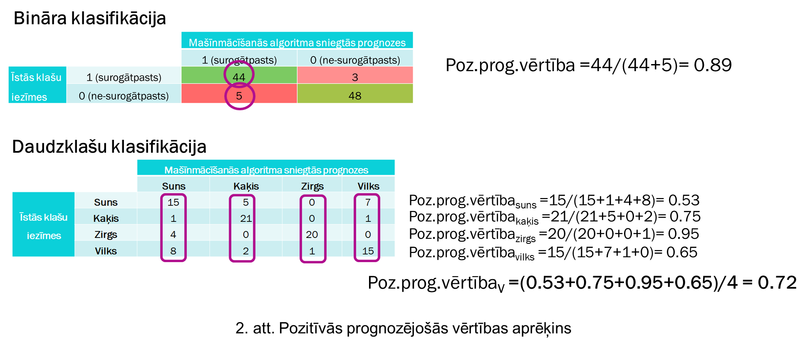

# 33_komanda_2_pd

## Sākums
* Izmantojam [Orange rīku](https://orangedatamining.com/)
* Datu kopa: [Alžīrijas mežu ugunsgrēki](https://archive.ics.uci.edu/dataset/547/algerian+fores+fires+dataset)

Vēl atrādīju šadus datasetus, ko varētu teoretiski izmantot:
* [Wholesale customers](https://archive.ics.uci.edu/dataset/292/wholesale+customers) - kā saprotu, tie ir fake dati
* [Steel Industry Energy Consumption](https://archive.ics.uci.edu/dataset/851/steel+industry+energy+consumption) - šitos vnk nesaprotu, bet vrb būtu vērts tājos apskatīt. idk

## I daļa
Datu kopā ir 244 piemēri diviem Alžīrijas regioniem: Bejaia un Sidi Bel-abbes. Mēs apvienojām to vienā.

| Kolonma | Pilns vārds | Tips | Apraksts | Mērvienība | Komentārs |
| - | - | - | - | - | - |
| day |  | Int | | | Skipot? |
| month |  | Int | | | Skipot? |
| year |  | Int | | | Defo skipot, vienmēr 2012 |
| Temperature |  | Int | Temperatūra pūsdienlaikā | °C
| RH | Relative Humidity | Int | Relatīvais mitrums | %
| WS | Wind Speed | Int | Vēja ātrums | km/h
| Rain | | Float | | mm
| FFMC | Fine Fuel Moisture Code | Float | Smalkas degvielas mitruma kods (*Код влажности мелкого топлива*) | | Izpētīt
| DMC | Duff Moisture Code | Float | Duff mitruma kods (*Код влажности Даффа*)  | | Izpētīt
| DC | Drought Code | Float | Sausuma kodekss | | Izpētīt
| ISI | Initial Spread Index | Float | Sākotnējais izplatības indekss | | Izpētīt
| BUI | Buildup Index | Float | Uzkrāšanās indekss | | Izpētīt
| FWI | Fire Weather Index | Float | Ugunsgrēka laika indekss | | Izpētīt
| Fire | | Bool | Ir vai nav ugunsgrēks

Taisīju visu pēc šī [video](https://www.youtube.com/watch?v=bmwH3EcTBEM)
Pielādēju kopu, atvēru Orange rīkā. Pafiksēju tur datus, bija problēma ar pāris piemēriem. Skipoju Year kolonu, jo ta ir vnk 2012. Pārsaucēju Classes kolonu uz Fire. Ar Continuize widgetu visus pārējus kolonus normalizēju uz intervālu [0,1]. Pēc tam ar Impute widgetu nofiltrēju liekus piemērus ārā, bet tādu īsti nav. Pēc tām pievienoju Feature Statistics, Distributions un Scatter Plot. Visiem atzīmeju Fire kolonu kā Color, lai dati tika savakti, ņemot vērā šo kolonu kā galveno. Pedējā widgetā, palaižot 'Find Informative Projections', var ieraudzīt, ka vislābāk atdālā datus atribūtu kombinācija ISI/FFMC. Jā, mums tikai 2 klasi, hz vai tas ir slikti. IMO nav. Arī pievienoju Correlations widgetu, tur nekas interesants nav, vislābāka korelācija ir ISI:RH atributiem

## II daļa
Jaunus widgetus pievienoju zēmāk, lai labāk redzēt darba daļas. Pievienoju k-Means widgetu, ieliku iestātījumus gandrīz, ka [video](https://www.youtube.com/watch?v=ojxvlQSYLr0). Pēc tām pievienoju Scatter Plot, lai attēlotu dabūtos klasterus. Šoreiz palaižot Find Informative Projections, sanāca, ka labāk atdālā klasterus atrībutu kombinācija BUI/FFMC. Pēc tām pievienoju Distances un tam Hierarchical Clustering. Pēdējā widgetā jāpaspēlās ar to līniju, jāpabīdē to. Hz, man ne īsti sanāca.

## III daļa
CA (Classification Accuracy) - Precizitātes metrika - $\dfrac{pareizās\:prognozes}{visas\:prognozes}$

Precision - Pozitīvā prognozējošā vērtība - $\dfrac{TP}{TP\:+\:FP}$ - cik daudz piemēru, kas tika klasificēti kā ūgunsgrēks, realitātē tiešām ir ūgunsgrēks. **Šī vērtība mums vairāk interesē**. Labāk nepareizi klasificētu kaut kādu testa piemēru kā ūgunsgrēks, neka palaist kādu piemēru garam, kas tiešam ir ūgunsgreks.

Recall - Jutīguma metrika - $\dfrac{TP}{TP\:+\:FN}$ - cik daudz piemēru, kas realitāte ir ūgunsgrēks, tika klasificēti kā ūgunsgrēks

F1 - F1 mērs - $\ 2 * \dfrac{Pozitīva\:prognozējošā\:vērtība\:*\:Jūtigums}{Pozitīva\:prognozējošā\:vērtība\:+\:Jūtigums}$

AUC, MCC - hz - varam neiekļaut atskaitē

Model | ~~AUC (Area Under the Curve)~~ | CA (Classification Accuracy) | F1 | Precision | Recall (Jūtīgums) | ~~MCC (Matthews Correlation Coefficient )~~
| - | - | - | - | - | - | - |
kNN | ~~0.978~~ | 0.904 | 0.903 | 0.906 | 0.904 | ~~0.804~~
Neural Network | ~~0.996~~ | 0.973 | 0.973 | 0.973 | $\color{green}{\textsf{0.973}}$ | ~~0.944~~
Logistic Regression | ~~0.988~~ | 0.959 | 0.959 | 0.959 | 0.959 | ~~0.916~~

> Darba atskaitē ir jāiekļauj šāda informācija par šo darba daļu:
> * Īss apraksts (1/3 no A4 lapas) diviem brīvi izvēlētajiem algoritmiem un to izvēles motivācijai (izņemot mākslīgo neironu tīklu), norādot arī atsauces uz izmantotajiem informācijas avotiem.

Mums ir parraudzīta mācīšana (tēma 4.1), jo ir skolotājs - piemēra dati 
* kNN - k-tuvāko kaimiņu metode (4.2)  - to paņemu no tutoriala - kaut ko jāizdomā, kpc šīs algoritms ir vērts izmantot. Šīm algoritmam ir sliktākais rezultāts.
* Linear Regression (4.2) - Lineāra regressija - nestrāda, jāpaskaidro, kāpēc. 
* Logistic Regression (4.2) - Loģistiska regresija - strāda čotka, labāk par kNN, sliktāk par Nirona tīklu
* Neural Network - Nirona tīkls (4.5) - šīto pēc defaulta jāizmanto, vislabāk klasificē testa datus

Par tiem diviem parējiem algoritmiem (K-videjo algoritms un Hierarhiskā klasterēšana): tie vairāk bija realizēti 2. daļā. Līdz ar to patiesībā visus pieejamus algoritmus esam izmēģinājusi (lineāra regresija, loģistiska regresija, kNN algoritms un neirona tīkls). Skat. att. zemāk.

Paņemts no [III daļa](https://estudijas.rtu.lv/mod/hvp/view.php?id=5236887#h5pbookid=52820&chapter=h5p-interactive-book-chapter-3556d0c8-acd0-457c-ae33-196f2f6f1f76&section=0)

> Darba atskaitē ir jāiekļauj šāda informācija par šo darba daļu:
> * Katram algoritmam ir jāapraksta visi Orange rīkā pieejamie hiperparametri un to nozīme.

* kNN - attāluma metrika: izmantojam Eiklīda attālumu, k=5 (kā saprotu, hz īsti, kas tur notiek, to ir jāizpēta)
* Neirona tīkls - paņēmu vnk no tutoriala - divi hidden layeri ar 100 neironiem katrs. Mācīšanas ātrums alpha=0.1. Viņa tutorialā vēl teica kko par Activation: Logistic. Es arī to izmantoju, bet hz uz ko tā ietekme. Jāpalasa 4.5. tēma
* Logistiskā regresija - nav hiperparametru

> * Informācija par testu un apmācības datu kopām: a)   kopējais testa un apmācības datu kopām pievienoto datu objektu skaits (skaits un %) un b) informācija par to, cik datu objektu no katras klases ir iekļauts apmācības un testa datu kopās (skaits un %).

Ar Data Sampler widgetu sadalīju visus datus 70/30 apmācība un testa kopā. Pavisam ir 244 piemēri.

> * Katram algoritmam tabulas veidā ir jāatspoguļo eksperimentos izmantotās hiperparametru vērtības un jādod ekrānizdrukas, kurās ir redzamas šīs vērtības un eksperimentu veiktspējas metrikas.
> * Secinājumi par modeļu veiktspēju veiktajos eksperimentos, skaidri identificējot modeli, kas tiks izmantots testēšanā.

Labākais, ka jau teicu, bija nierona tīkls pēc visiem parametriem. Jāprecizē, tomēr, ka mums interesē jūtīgums

> * Apmācīto modeļu testēšanas rezultāti un to veiktspējas salīdzinājums un interpretācija, tos skaidri nodalot no apmācības eksperimentiem. 
